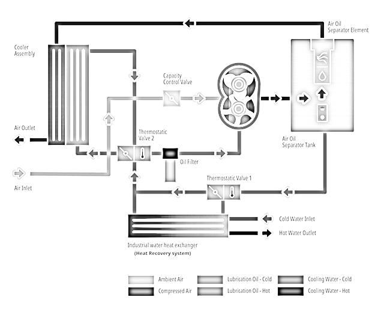
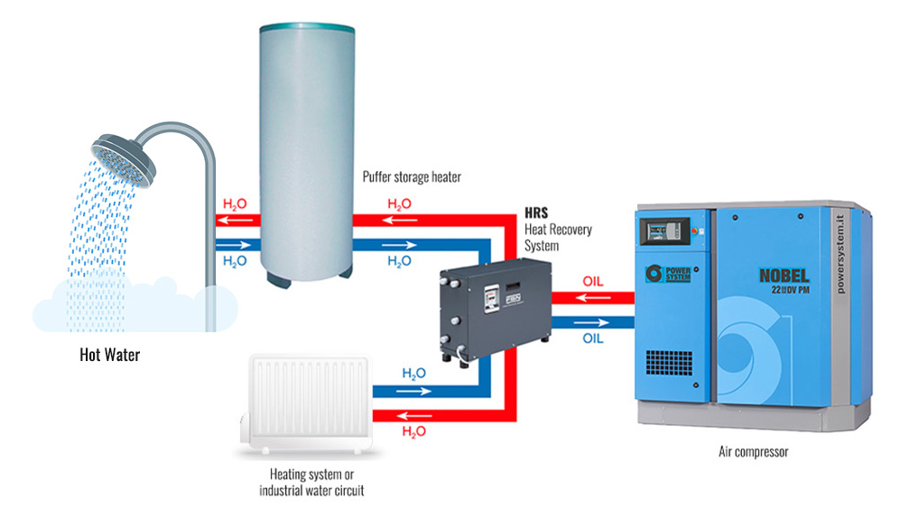

# Industrial Waste Heat Recovery System for Air Compressor and Thermopac Exhaust

## Overview

Air compressors and Thermopac boilers reject a significant amount of thermal energy during normal plant operation. This project proposes a two-stage waste heat recovery system that captures this energy to preheat demineralized water used in DC washing processes at Wheels India Limited.

The solution was developed during my internship to improve energy efficiency, reduce Light Diesel Oil (LDO) consumption and support sustainable manufacturing practices.

## Existing system

The existing DC washing process at Wheels India Limited uses Thermopac boilers fired with Light Diesel Oil (LDO) to heat Thermo-32 oil, which is then used to produce hot water for industrial washing operations.

However, significant thermal energy from compressor lubricating oil and Thermopac chimney exhaust is rejected to the surroundings without recovery, resulting in unnecessary fuel consumption and lower overall energy efficiency.

## Problem Statement

The existing heating system presents several engineering challenges:

- High dependence on Light Diesel Oil (LDO).
- Significant waste heat from air compressors.
- Thermal energy loss through Thermopac chimney exhaust.
- Increased operating cost due to fuel consumption.
- Higher carbon emissions and environmental impact.
- Opportunity to recover available waste heat remains unused.

## Proposed Solution

The proposed system utilizes two independent sources of waste heat available within the plant:

1. **Compressor Oil Heat Recovery** – Heat from compressor lubricating oil is transferred to demineralized (DM) water through a plate-type heat exchanger.

2. **Thermopac Chimney Heat Recovery** – Heat from the Thermopac exhaust gases is recovered using a flue gas economizer to further increase the water temperature before entering the washing process.

The combined system reduces the dependence on fossil fuel while utilizing energy that would otherwise be wasted.

## Benefits

- [x] Reduced Light Diesel Oil (LDO) consumption
- [x] Improved thermal efficiency
- [x] Lower operating cost
- [x] Reduced CO₂ emissions
- [x] Better utilization of waste heat
- [x] Supports sustainable manufacturing
- [x] Minimal modification to the existing plant

## My Contribution

This project was carried out during my internship at Wheels India Limited.

My primary contributions included:

- Identifying waste heat sources within the plant.
- Developing the proposed heat recovery concept.
- Performing engineering calculations and feasibility analysis.
- Preparing system diagrams and technical documentation.
- Presenting the proposed solution to the company.

## Implementation Overview

The proposed system can be implemented with minimal modification to the existing plant.

- A plate-type heat exchanger transfers heat from compressor lubricating oil to demineralized (DM) water.
- A flue gas economizer recovers additional heat from the Thermopac chimney exhaust.
- The preheated water is stored in the existing DM water tank before being supplied to the DC washing process.
- Temperature sensors, control valves and circulation pumps are incorporated to ensure safe and efficient operation.

## Technical Observations

The proposed system demonstrated the feasibility of utilizing waste heat available within the plant.

Key observations include:

- Compressor oil increased the water temperature from approximately 70 °C to 77 °C.
- Additional heat recovery from the Thermopac exhaust can further increase the water temperature.
- The recovered heat has the potential to significantly reduce Light Diesel Oil (LDO) consumption.
- The proposed system requires only minor modifications to the existing infrastructure.

## Conclusion

The proposed waste heat recovery system provides a practical approach to improving energy efficiency in industrial washing processes by utilizing heat that would otherwise be lost.

By recovering energy from compressor lubricating oil and Thermopac exhaust gases, the system has the potential to reduce fuel consumption, lower operating costs and support sustainable manufacturing practices with minimal changes to the existing plant.

  
